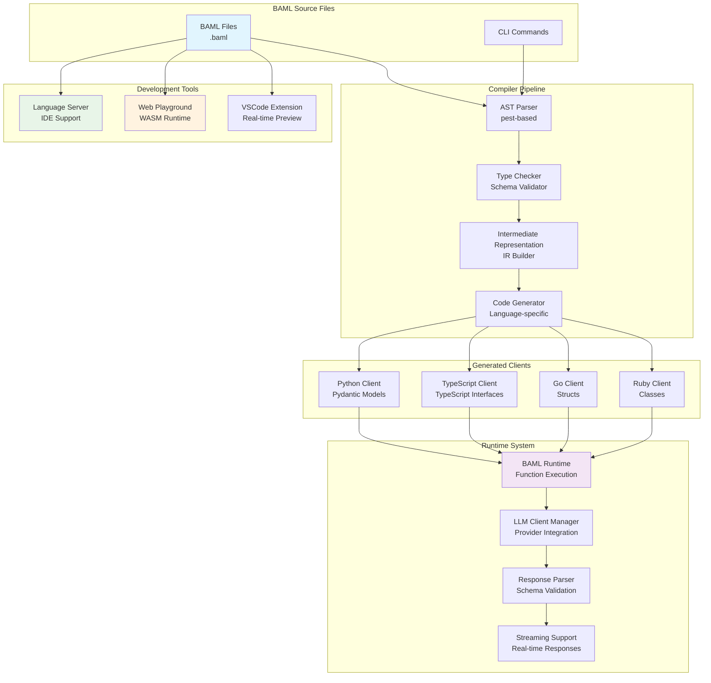
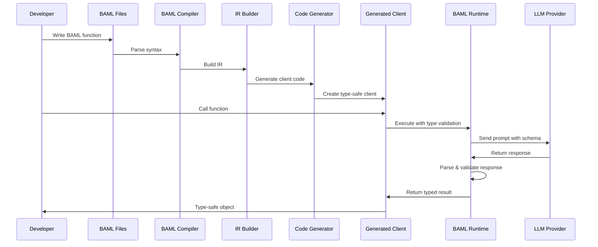
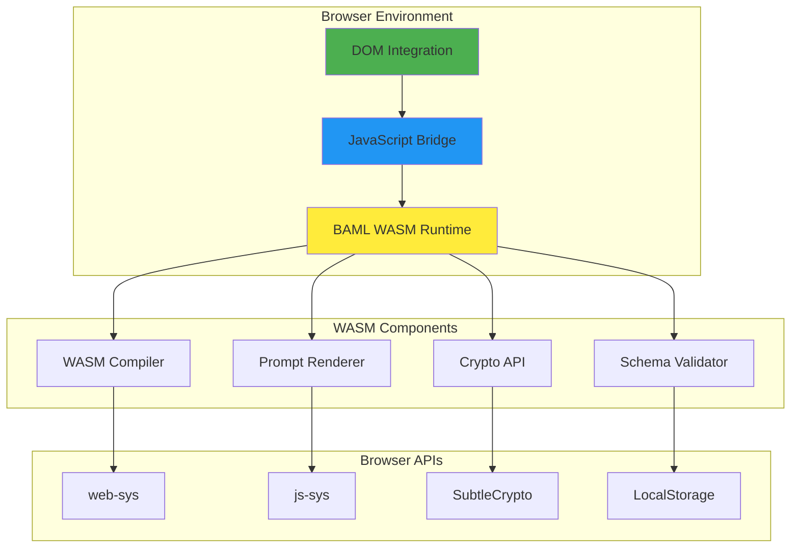
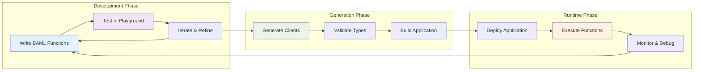

# BAML Architecture

BAML (Basically a Made-up Language) is a **prompting language for building reliable AI workflows and agents**. This document describes the high-level architecture and how components interact.

## Overview

BAML transforms prompt engineering into schema engineering by providing:
- **Type-safe function definitions** with explicit input/output schemas
- **Multi-language client generation** (Python, TypeScript, Ruby, Go, etc.)
- **Cross-platform runtime** (Native Rust + WebAssembly)
- **IDE integration** with Language Server Protocol (LSP)
- **Real-time development tools** (Playground, VSCode extension)

## Core Architecture



## Component Details

### 1. Language Core (`engine/baml-lib/`)

The heart of BAML consists of specialized modules:

#### Core Components
- **`baml-core/`** - Main compiler logic and core functionality
- **`ast/`** - Abstract Syntax Tree definitions using pest parser
- **`baml-types/`** - Core type system and data structures
- **`baml-derive/`** - Procedural macros for code generation
- **`diagnostics/`** - Error handling and diagnostic messages

#### Template Engine
- **`jinja/`** & **`jinja-runtime/`** - Template engine for prompt processing
- **`jsonish/`** - JSON parsing and schema validation
- **`prompt-parser/`** - BAML syntax parsing

#### LLM Integration
- **`llm-client/`** - LLM provider integrations (OpenAI, Anthropic, Gemini, etc.)
- **`parser-database/`** - Parser state management

### 2. Runtime System (`engine/baml-runtime/`)

Handles function execution and provides cross-platform support:

- **Function Execution** - Type-safe function calling with schema validation
- **LLM Client Management** - Unified interface for different providers
- **Streaming Support** - Real-time response handling
- **Cross-Platform** - Native Rust + WebAssembly support
- **AWS Integration** - Bedrock and other AWS services

### 3. Language Server (`engine/language_server/`)

Provides IDE support with LSP implementation:

- **Code Completion** - Intelligent suggestions for BAML syntax
- **Real-time Diagnostics** - Error checking and validation
- **Playground Server** - Web-based development environment
- **Hover Information** - Context-aware help and documentation

### 4. Multi-Language Client Generation

BAML generates type-safe clients for multiple languages:

#### Supported Languages
- **Python** (`engine/language_client_python/`) - Pydantic models
- **TypeScript** (`engine/language_client_typescript/`) - TypeScript interfaces
- **Ruby** (`engine/language_client_ruby/`) - Ruby classes
- **Go** (`engine/language_client_go/`) - Go structs
- **C/C++** (`engine/language_client_cffi/`) - C foreign function interface

#### Code Generation System
- **`engine/generators/`** - Language-specific code generators
- **`engine/language_client_codegen/`** - Shared generation utilities
- **`engine/baml-schema-wasm/`** - WebAssembly schema validation

## Data Flow Architecture



## Schema System

### Input/Output Schema Example

```baml
class Resume {
  name string
  education Education[] @description("Extract in the same order listed")
  skills string[] @description("Only include programming languages")
}

class Education {
  school string
  degree string
  year int
}

function ExtractResume(resume_text: string) -> Resume {
  client "openai/gpt-4o"
  prompt #"
    Parse the following resume and return a structured representation.
    
    Resume:
    ---
    {{ resume_text }}
    ---
    
    {{ ctx.output_format }}
  "#
}
```

### Type Safety in Generated Clients

#### Python Example
```python
from baml_client import b
from baml_client.types import Resume

# Type-safe function call
resume: Resume = b.ExtractResume("John Doe\nEducation: CS, Berkeley, 2020")

# Type-safe access to properties
print(resume.name)  # IDE knows this is a string
print(resume.education[0].school)  # Nested type safety
```

#### TypeScript Example
```typescript
import { b } from './baml_client';
import { Resume } from './baml_client/types';

async function processResume(): Promise<Resume> {
  const resume = await b.ExtractResume("John Doe\nEducation: CS, Berkeley, 2020");
  console.log(resume.name); // TypeScript knows this is string
  return resume; // Return type is guaranteed to be Resume
}
```

## Structured Prompt System

### Jinja Template Engine

BAML uses Jinja templating for dynamic prompt generation:

```baml
template_string PrintMessages(messages: UserMessage[]) #"
  
    {{ _.role(m.role) }}
    {{ m.message }}
  
"#

function ClassifyConversation(messages: UserMessage[]) -> Category[] {
  client "openai/gpt-4o"
  prompt #"
    Classify this conversation:
    {{ PrintMessages(messages) }}
    
    Use the following categories:
    {{ ctx.output_format}}
  "#
}
```

### Special Template Variables

- **`{{ ctx.output_format }}`** - Automatically generates format instructions
- **`{{ _.role("user") }}`** - Define message roles for conversation
- **`{{ ctx.client }}`** - Selected client and model information

## WASM Runtime Architecture

The WebAssembly runtime enables full BAML functionality in browsers:



### WASM Runtime Features

1. **Browser-based Compilation**
   - Parse and validate BAML files in browser
   - Generate type definitions and client code
   - Real-time syntax checking and diagnostics

2. **Prompt Rendering**
   - Render Jinja templates with actual data
   - Show exact prompts sent to LLMs
   - Preview multi-modal content (images, audio, video)

3. **Schema Validation**
   - Validate JSON responses against BAML schemas
   - Parse and fix malformed LLM outputs
   - Provide detailed error messages

4. **Browser Integration**
   - Uses browser's `SubtleCrypto` for JWT signing
   - Virtual file system for BAML projects
   - WebSocket integration for live editing

## Development Workflow



## Key Architectural Principles

### 1. Schema-First Design
- Functions are defined with explicit input/output schemas
- Type safety across all generated clients
- Structured prompt engineering

### 2. Multi-Provider LLM Support
- Unified interface for different LLM providers
- Support for OpenAI, Anthropic, Gemini, Bedrock, Azure, etc.
- Fallback and retry mechanisms

### 3. Cross-Platform Runtime
- Native Rust performance
- WebAssembly support for browser environments
- Platform-specific optimizations

### 4. Developer Experience
- LSP integration for IDE support
- Playground for rapid iteration
- Comprehensive testing framework

## Integration Points

### External Integrations
- **VSCode Extension** (`engine/zed/`)
- **JetBrains Plugin** (`jetbrains/`)
- **Web Playground** (WASM-based)
- **Cloud Services** (AWS, GCP, Azure)

### Testing & Validation
- **Integration Tests** (`integ-tests/`)
- **End-to-End Tests** (`e2e_tests.py`)
- **Generator Tests** (`engine/generators/`)

## Performance Characteristics

- **Compilation**: Fast Rust-based compilation
- **Runtime**: Minimal overhead with native performance
- **WASM**: Near-native performance in browsers
- **Type Safety**: Compile-time validation with zero runtime cost
- **Streaming**: Real-time response handling with minimal latency

## Security Considerations

- **Type Safety**: Prevents injection attacks through schema validation
- **WASM Isolation**: Sandboxed execution in browser environments
- **Crypto Integration**: Uses browser's native crypto APIs
- **No Network Requests**: Except for explicit LLM calls
- **Local Processing**: All compilation and validation happens locally

This architecture enables **prompt engineering as schema engineering**, providing type safety, reliability, and developer productivity across multiple programming languages while maintaining the flexibility to work with various LLM providers. 